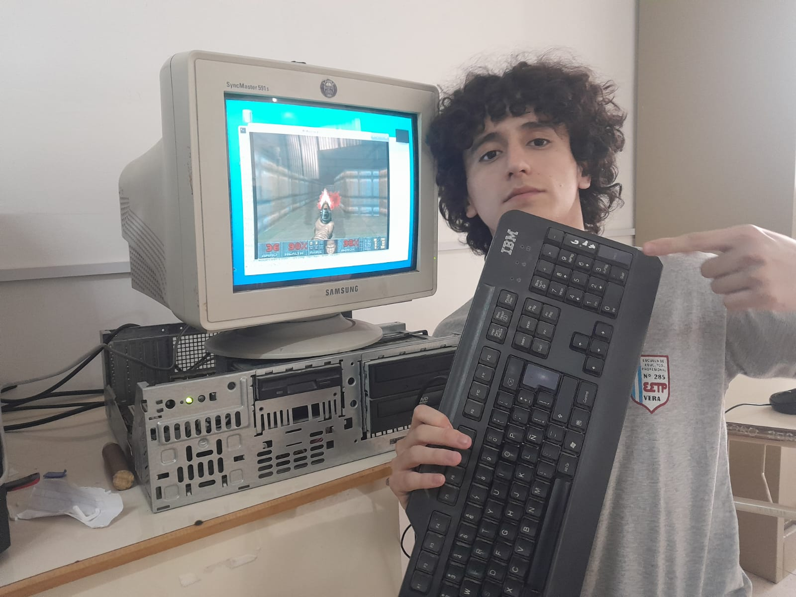

# Floyd
Este es “Floyd”, una versión del clásico videojuego “Pong” hecha con una placa Arduino Uno, un viejo monitor que encontramos tirado afuera de nuestra aula, un manojo de cables y mucho amor. En pocas palabras, el fruto de mucho aburrimiento y unos profesores muy amargados. Gracias a todas estas cosas pudimos darles unos minutos de diversión a los chicos y chicas de esta ciudad de mierda

Me gustaría inmortalizar este proyecto en internet para que cualquier boludo pueda jugarlo. Si tenés ganas y estás al pedo, te invito a probar esta hermosa y simple creación de dos amigos de secundaria.

# Expo Técnica, Noviembre 2024

<video controls src="imagenes/gameplay.mp4" title="gameplay"></video>
<3

<video controls src="imagenes/gato.mp4" title="beta testing"></video>
Tres boludos haciendo beta testing

<video controls src="imagenes/render.mp4" title="Inicios"></video>
Así empezamos, renderizando algo en pantalla.

Pepe

h3 

"Este proyecto no es nuestro, es de todos los alumnos aburridos de secundaria ... es del pueblo"